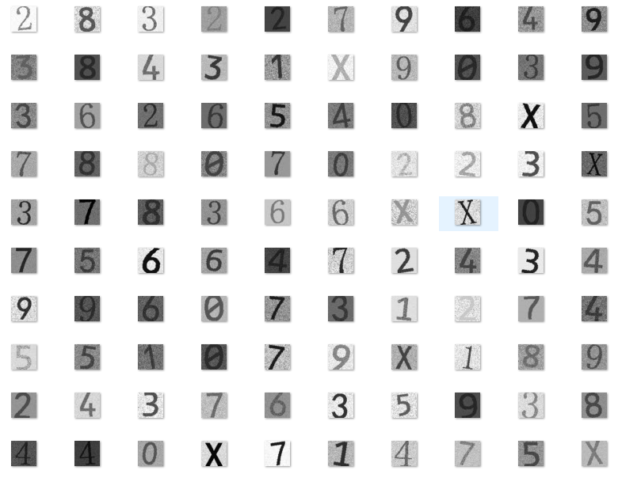
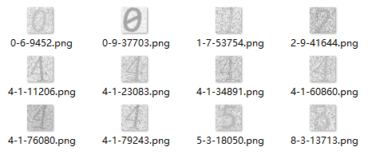
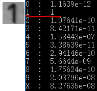
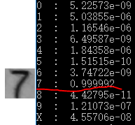
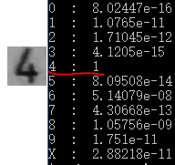
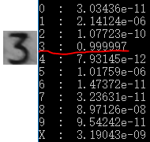
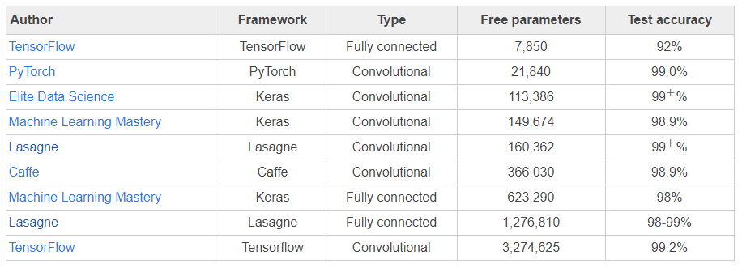
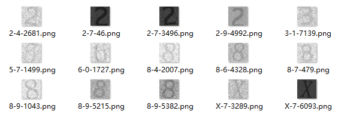

# 项目简介

本项目是一个基于keras的印刷体数字字符识别玩具。记得十几年前曾尝试在一身份证扫描仪设备的ARM裸系统上用C语言实现身份证号码图像识别的功能，当时的做法是先把图像二值化，然后计算二值图像与模板图像之间的距离，识别率好像都不到80%，真够Low的:(
最近上完了[deeplearning.ai](https://deeplearning.ai)的课程，需要找一个小项目练手，恰好有个做身份证扫描仪的朋友需一个识别引擎，嗯，是个遛一遛的好机会。

相比MNIST的手写数字识别，理论上印刷体的识别难度要小很多（过身份证号码需要多识别一个字符‘X’）。任务的挑战在于没有可以用于训练的样本，或者说这么个小任务花成本做labelling太不划算了！

咋办？ 在上[deeplearning.ai](https://deeplearning.ai)的课程之前花了一段时间学概率，现在派上用场，很自然想到用概率模型通过程序生成训练样本，只要软件生成的样本的distribution能覆盖或接近实际应用样本的distribution，模型就能发挥实际用处。

# 一、生成训练样本
Google了一下，发现Python生态下生成图像要比C++/Qt简单太多了，PIL + numpy 一行代码要顶几十行C++代码的感觉！

为了能让生成的图像的特征分布尽可能接近真实数据的特征分布，生成算法引入了以下几个变化维度：
- 背景平均亮度
- 背景亮度变化范围
- 字符平均亮度
- 字符亮度变化范围
- 字符旋转角度
- 字符缩放
- 字符白边
- 字体类型

每个维度的变化均用正态分布模拟，参数的冗余度足够大，确保生成的数据的特征覆盖真实数据的特征分布：

```
# char_img_gen.py 生成训练样本

import char_img_gen as cg

X, Y = cg.gen_batch_examples(batch_size = 100, img_size = 32, font_dir = './font', output_path = './examples')
```
上面两行代码生成100个图像尺寸为32*32的训练样本，使用./font目录下的字体文件，生成的图像输出在./examples目录下，图长这样的：



图看起来还是那么回事，不过字符的边缘与背景少了点融合过渡的感觉，应该要加个是否做低通滤波的随机维度，anyway，先用起来。

# 二、构建模型
毫无疑问选用ConvNet模型，根据Professor Andrew Ng 的教导，“随着网络的层次加深，feature map的尺寸越来越小，channel number越来越大……”，少废话上代码：
```
# digitx_model.py

def digitx_model(input_shape):

    X_input = Input(input_shape, name = 'input')
    X = Conv2D(16, (5, 5), strides = (1, 1), padding = 'same', name = 'conv0')(X_input)
    X = BatchNormalization(axis = 3, name = 'bn0')(X)
    X = Activation('relu')(X)
    X = MaxPooling2D((2, 2), name = 'max_pool0')(X)

    X = Conv2D(32, (3, 3), strides = (1, 1), padding = 'same', name = 'conv1')(X)
    X = BatchNormalization(axis = 3, name = 'bn1')(X)
    X = Activation('relu')(X)
    X = MaxPooling2D((2, 2), name = 'max_pool1')(X)

    X = Conv2D(64, (3, 3), strides = (1, 1), padding = 'same', name = 'conv2')(X)
    X = BatchNormalization(axis = 3, name = 'bn2')(X)
    X = Activation('relu')(X)
    X = MaxPooling2D((2, 2), name = 'max_pool2')(X)

    X = Flatten()(X)
    X = BatchNormalization(axis = 1, name = 'bn3')(X)
    X = Dense(128, activation='relu', name = 'after_flatten')(X)
    X = Dense(64, activation='relu', name = 'after_flatten2')(X)
    X = Dense(11, activation='softmax', name = 'softmax_out', kernel_initializer = glorot_uniform())(X)

    model = Model(inputs = X_input, outputs = X, name = 'digitx_model')

    return model

```
模型结构如下：
```
Layer (type)                 Output Shape              Param #
=================================================================
input (InputLayer)           (None, 32, 32, 1)         0
_________________________________________________________________
conv0 (Conv2D)               (None, 32, 32, 16)        416
_________________________________________________________________
bn0 (BatchNormalization)     (None, 32, 32, 16)        64
_________________________________________________________________
activation_10 (Activation)   (None, 32, 32, 16)        0
_________________________________________________________________
max_pool0 (MaxPooling2D)     (None, 16, 16, 16)        0
_________________________________________________________________
conv1 (Conv2D)               (None, 16, 16, 32)        4640
_________________________________________________________________
bn1 (BatchNormalization)     (None, 16, 16, 32)        128
_________________________________________________________________
activation_11 (Activation)   (None, 16, 16, 32)        0
_________________________________________________________________
max_pool1 (MaxPooling2D)     (None, 8, 8, 32)          0
_________________________________________________________________
conv2 (Conv2D)               (None, 8, 8, 64)          18496
_________________________________________________________________
bn2 (BatchNormalization)     (None, 8, 8, 64)          256
_________________________________________________________________
activation_12 (Activation)   (None, 8, 8, 64)          0
_________________________________________________________________
max_pool2 (MaxPooling2D)     (None, 4, 4, 64)          0
_________________________________________________________________
flatten_3 (Flatten)          (None, 1024)              0
_________________________________________________________________
bn3 (BatchNormalization)     (None, 1024)              4096
_________________________________________________________________
after_flatten (Dense)        (None, 128)               131200
_________________________________________________________________
after_flatten2 (Dense)       (None, 64)                8256
_________________________________________________________________
softmax_out (Dense)          (None, 11)                715
=================================================================
Total params: 168,267
Trainable params: 165,995
Non-trainable params: 2,272
```
一共有165,995个参数需要训练，P大点任务，搞这么大个模型，牛刀宰鸡。。。

用512的mini-batch size训练1000个epoch，看看啥效果：
```
>>> import digitx_model as dm
>>> model = dm.create()
>>> dm.train(model, 1000)
.....
At epoch 990: [7.328528e-05, 1.0]
At epoch 991: [7.358444e-05, 1.0]
At epoch 992: [5.6470384e-05, 1.0]
At epoch 993: [0.00016964861, 1.0]
At epoch 994: [1.3736428e-05, 1.0]
At epoch 995: [0.00030441108, 1.0]
At epoch 996: [3.4015204e-05, 1.0]
At epoch 997: [3.3532924e-05, 1.0]
At epoch 998: [0.004409107, 0.9980469]
At epoch 999: [8.071612e-05, 1.0]
At epoch 1000: [4.9852726e-05, 1.0]
```
到第1000个epoch，loss小到小数点后5位了，accuracy差不多100%了，epoch 998错了一个样本，accuracy = 511/512 = 0.9980469。请留意train函数的实现，每个epoch训练所用样本都是现场调用gen_batch_examples生成的，也就是说模型在训练过程中永远不会见到重复的样本。

测试一下模型？其实意义不大，因为训练和测试用的样本都是同一个算法生成的，但看看分类失败的样本长啥样还是有必要的：

```
>>> import digitx_model as dm
>>> dm.test(model = model, example_num = 100000, save_error_image = True)
Accuracy = 0.99988
```
十万个样本没GPU得耐心等一会儿，99.988%的正确率貌似不错，看看预测失败的12个样本长啥样：





“0-6-9452.png”表示第9452个样本本来是‘0’，但被模型错误识别为‘6’了。从上图中可以看出识别错误的基本上都是对比度小且噪声大的样本，但第2个样本‘0’被识别成‘9’还是有些出乎意料！显然还是没人眼厉害。可能的原因是生成样本时字体类型是均匀随机采样的，而只有一种字体的‘0’中间有一条线，导致它的样本数量比例不够，因而模型对它的学习次数要少于其它字符。

# 三、应用实测

模型使用者不想安装Python+TensorFlow+Keras，只能用C++源代码集成！着急……

用“keras C++” google了一下，找到几个项目，比较一番，最后选定[frugally-deep](https://github.com/Dobiasd/frugally-deep)，
它可直接加载keras模型文件后执行inference，全部是C++模板库，编译后独立运行啥外部库都不依赖！

拿手机在昏暗的地方对着身份证拍了一张照，扣出几个数字，然后用C++写了个demo调用frugally-deep，结果出来前还有些小激动：









嘿，预测精度居然到5个9以上了，还算是对得起这么大个模型:-)

# 四、尝试减小模型
上面的这个模型有16万多个参数，相比下表中的MNIST数据集，用这么大个模型总是感觉良心不安



表格来自这里：https://greydanus.github.io/2017/10/30/subspace-nn


太多可以下手的地方了，从何下手呢？最近刚读了论文[Network In Network](https://arxiv.org/pdf/1312.4400.pdf)，感觉受了启发，Professor Andrew Ng在deeplearning.ai的课程中重点讲解了这个网络结构，就是这篇论文创新的提出了1x1卷积和Global Average Pooling，1x1卷积也就是Network-In-Network，它一方面压缩了feature map的数量而减小参数数量，同时在卷积层之间引入了非线性变换，使得网络有机会学到更强大、高效的非线性表征，而Global Average Pooling替代softmax前的Full Connect层，让每个feature map经过average pooling后直接送给softmax层，极大的节省了参数的数量，同时迫使一个feature map与一个目标class对应，让网络的学习更具目的性和可解释性。说的这么美妙，何不试一试？

模型代码如下：
```
# digitx_model.py

def digitx_model2(input_shape):

    X_input = Input(input_shape, name = 'input')

    X = Conv2D(32, (5, 5), strides = (1, 1), padding = 'same', name = 'conv0')(X_input)
    X = BatchNormalization(axis = 3, name = 'bn0')(X)
    X = Activation('relu')(X)
    X = MaxPooling2D((2, 2), name = 'max_pool0')(X)
    X = Conv2D(16, (1, 1), strides = (1, 1), padding = 'same', name = 'nin0')(X)

    X = Conv2D(32, (3, 3), strides = (1, 1), padding = 'same', name = 'conv1')(X)
    X = BatchNormalization(axis = 3, name = 'bn1')(X)
    X = Activation('relu')(X)
    X = MaxPooling2D((2, 2), name = 'max_pool1')(X)
    X = Conv2D(16, (1, 1), strides = (1, 1), padding = 'same', name = 'nin1')(X)

    X = Conv2D(32, (3, 3), strides = (1, 1), padding = 'same', name = 'conv2')(X)
    X = BatchNormalization(axis = 3, name = 'bn2')(X)
    X = Activation('relu')(X)

    # arXiv 1312.4400 : generate one feature map for each corresponding category.
    # Network in network, 1x1 Conv shrink the channel number into catagory number
    # output shape (None, 8, 8, 11), each fearure represented by a 8x8 matrix
    X = Conv2D(11, (1, 1), strides = (1, 1), padding = 'same', name = 'nin2')(X)

    # arXiv 1312.4400 : take the average of each feature map,
    # fed the result vector directly into the softmax layer
    X = GlobalAveragePooling2D()(X)
    X = BatchNormalization(axis = 1, name = 'bn3')(X)
    X = Activation('softmax', name="softmax_out")(X)

    model = Model(inputs = X_input, outputs = X, name = 'digitx_model')

    return model
```
对应的模型结构如下：
```
Layer (type)                 Output Shape              Param #
=================================================================
input (InputLayer)           (None, 32, 32, 1)         0
_________________________________________________________________
conv0 (Conv2D)               (None, 32, 32, 32)        832
_________________________________________________________________
bn0 (BatchNormalization)     (None, 32, 32, 32)        128
_________________________________________________________________
activation_28 (Activation)   (None, 32, 32, 32)        0
_________________________________________________________________
max_pool0 (MaxPooling2D)     (None, 16, 16, 32)        0
_________________________________________________________________
nin0 (Conv2D)                (None, 16, 16, 16)        528
_________________________________________________________________
conv1 (Conv2D)               (None, 16, 16, 32)        4640
_________________________________________________________________
bn1 (BatchNormalization)     (None, 16, 16, 32)        128
_________________________________________________________________
activation_29 (Activation)   (None, 16, 16, 32)        0
_________________________________________________________________
max_pool1 (MaxPooling2D)     (None, 8, 8, 32)          0
_________________________________________________________________
nin1 (Conv2D)                (None, 8, 8, 16)          528
_________________________________________________________________
conv2 (Conv2D)               (None, 8, 8, 32)          4640
_________________________________________________________________
bn2 (BatchNormalization)     (None, 8, 8, 32)          128
_________________________________________________________________
activation_30 (Activation)   (None, 8, 8, 32)          0
_________________________________________________________________
nin2 (Conv2D)                (None, 8, 8, 11)          363
_________________________________________________________________
global_average_pooling2d_7 ( (None, 11)                0
_________________________________________________________________
bn3 (BatchNormalization)     (None, 11)                44
_________________________________________________________________
softmax_out (Activation)     (None, 11)                0
=================================================================
Total params: 11,959
Trainable params: 11,745
Non-trainable params: 214
_________________________________________________________________
```
共11745个参数，不到上个模型的十分之一，同样用512的mini-batch size训练1000个epoch，看看啥效果：
```
>>> import digitx_model as dm
>>> model = dm.create(use_global_average_pooling = True)
>>> dm.train(model, 1000)
.....
At epoch 990: [0.0074704234, 1.0]
At epoch 991: [0.007740305, 1.0]
At epoch 992: [0.007384127, 1.0]
At epoch 993: [0.008212354, 1.0]
At epoch 994: [0.00940041, 1.0]
At epoch 995: [0.00749358, 1.0]
At epoch 996: [0.0093844365, 1.0]
At epoch 997: [0.007915394, 1.0]
At epoch 998: [0.008234024, 1.0]
At epoch 999: [0.0096587185, 1.0]
At epoch 1000: [0.009220025, 1.0]
```
虽然最后10个epoch的accuracy都是100%了，但loss要比上一个模型高一个数量级！

测试一下？

```
>>> import digitx_model as dm
>>> dm.test(model = model, example_num = 10000, save_error_image = True)
Accuracy = 0.9985
```
果然loss加大了十倍，错误率也会加大十倍，1万个样本中预测失败的15个长这样：



相比上个模型，不甚理想:(

在NIN的论文中也用MNIST数据集跟其它模型做了对比，同样NIN没有取得最佳表现，其托词是“since MNIST has been tuned to a very low error rate”，并没有进一步的分析。我的推测是Global Average Pooling可能更适用于高分辨率的图像而不是小尺寸的字符图像，如果Input的分辨率太低，经过几次max pooling就把feature map的分辨率降到不能效表达原始图像的特征了，为此，上面的模型还特意在最后一层NIN之前没有做pooling。总之，虽然有Professor Andrew Ng的系列Best Practice指导，训练网络还是感觉像赶一头不知脾气的怪兽前行，这里挠挠，那里敲敲，一会儿走几步，一会儿停下来，偶尔还倒退几步，然后你就得想哪儿不舒服了？是不是刚才敲的太重了点？…………

# 五、结论
本玩具项目提供了一个无需数据集即可产生具有一定实用价值的印刷体字符图像分类模型，改动几行代码可方便扩展到不同印刷字符集的分类任务上。
因为分类目标类型和数量可以自由选择（脱离了对特定数据集的依赖），也可以作为游乐场学习模型结构和超参数调优，至少比完全随机的数据集玩起来更能学得直觉吧:-)
